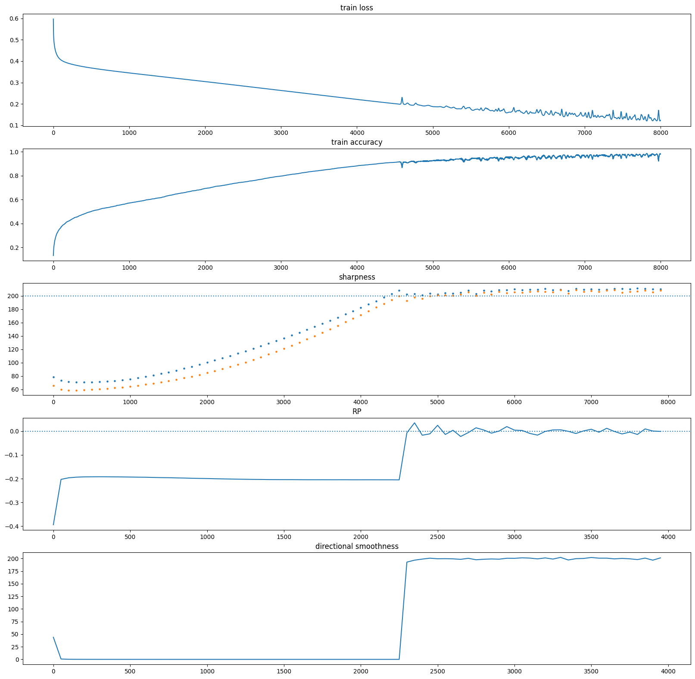

## Understanding the unstable convergence of gradient descent


Source code for the paper [Understanding the unstable convergence of gradient descent
](https://proceedings.mlr.press/v162/ahn22a.html) by Kwangjun Ahn, Jingzhao Zhang, Suvrit Sra. 
The implementation is copied from https://github.com/locuslab/edge-of-stability, and only the computation of 
"relative progress (RP)" and "directional smoothness (DS)" are added, for full instructions please visit the original repository. 
Please note that whenever the gradient appears 
in the formulas it is defined in this work as the update vector at step $t$, i.e the update vector is defined as
$$U(t)=\frac {\theta ^ {t+1} - \theta ^ {t} }{\eta}$$
and then the RP is defined as
$$RP(\theta)=\frac{ f(\theta - \eta U(t)) - f(\theta) }{\eta ||U(t)||^2}$$
and DS is defined as
$$L(\theta, \eta U(t)) = \frac{ < U(t), U(t)-U(t+1) > }{\eta ||U(t)||^2}$$
when using vanilla gradient descent this implementation is equivalent to using the gradient, but note that when using momentum or other methods this implementation is not the same since the update vector is not equal to the gradient. The reason for this implementation is to attempt to generalize the definitions in the paper to optimization methods other than vanilla GD.
```python
dataset = "cifar10-5k"
arch = "fc-tanh"
loss = "mse"
gd_lr = 0.006
gd_eig_freq = 100
gd_RP_DS_freq = 50
opt = "gd"
momentum = 0.5
```

```bash
!python /content/src/gd.py \
$dataset \
$arch  \
$loss  \
$gd_lr \
5000 \
--acc_goal 0.99 \
--neigs 1  \
--eig_freq $gd_eig_freq \
--RP_DS_freq gd_RP_DS_freq \
--opt $opt \
--beta $momentum
```

```python
import torch
import matplotlib.pyplot as plt
from os import environ

gd_directory = f"{environ['RESULTS']}/{dataset}/{arch}/seed_0/{loss}/gd/lr_{gd_lr}"

gd_train_loss = torch.load(f"{gd_directory}/train_loss_final")
gd_train_acc = torch.load(f"{gd_directory}/train_acc_final")
gd_sharpness = torch.load(f"{gd_directory}/eigs_final")
gd_RPs = torch.load(f"{gd_directory}/RPs_final").detach()
gd_DSs = torch.load(f"{gd_directory}/directional_smoothness_final").detach()

plt.figure(figsize=(20, 20), dpi=100)

subplots = (5, 1)
plt.subplot(*subplots, 1)
plt.plot(gd_train_loss)
plt.title("train loss")

plt.subplot(*subplots, 2)
plt.plot(gd_train_acc)
plt.title("train accuracy")

plt.subplot(*subplots, 3)
for i in range(gd_sharpness.shape[1]):
  plt.scatter(torch.arange(len(gd_sharpness)) * gd_eig_freq, gd_sharpness[:,i], s=5)
plt.axhline(2. / gd_lr, linestyle='dotted')
plt.title("sharpness")

plt.subplot(*subplots, 4)
plt.plot(torch.arange(len(gd_RPs)) * gd_RP_DS_freq, gd_RPs)
plt.axhline(0, linestyle='dotted')
plt.title("RP")

plt.subplot(*subplots, 5)
plt.plot(torch.arange(len(gd_DSs)) * gd_RP_DS_freq, gd_DSs)
plt.title("directional smoothness")
```


